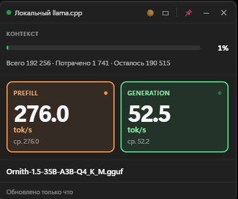
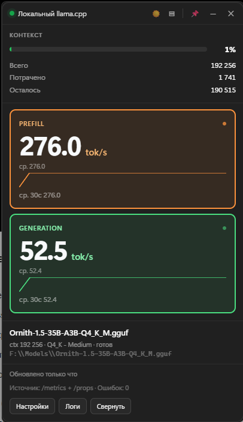

# llama.cpp Monitor

[](LICENSE)
[](https://github.com/aleksandrreva-eng/llama-monitor/releases/latest)
[](https://github.com/aleksandrreva-eng/llama-monitor/releases)
[](#requirements)
[](https://tauri.app)
[](https://svelte.dev)

🇷🇺 [Русская версия](README.ru.md)

A floating desktop widget for Windows 11 that shows the state of a local or
network **llama.cpp** server: context usage, inference speeds, the loaded model,
and connection status.

Stack: **Tauri 2 (Rust) + Svelte 4**.

> **[Download the latest release](https://github.com/aleksandrreva-eng/llama-monitor/releases/latest)**
> — a `.msi` installer for Windows 11 x64. Installation details are in
> [Quick start](#quick-start).

---

## Features

- A floating compact window you can drag around and pin above other windows (always-on-top).
- Minimize to the system tray, auto-start with Windows, remember window position and size.
- Dark and light themes (auto/light/dark) in a Windows 11 style.
- Context display: total / used / free, plus a progress bar with a smooth green→yellow→red gradient.
- **Prefill** and **Generation** speeds in tokens/sec with a 30-second sliding average.
- Loaded model info (name, quantization, context size, build version).
- Connection status and last-update time.
- Correct fallbacks ("N/A", "no data", "Model not detected") instead of crashes when data is missing.

---

## Screenshots

Dark theme, data from a live server (`--metrics` enabled).

| Compact mode | Expanded mode |
| :---: | :---: |
|  |  |

In expanded mode the widget adds 30-second speed sparklines, the full `.gguf`
path, the data source (`/metrics` + `/props`), an error counter, and the
"Settings", "Logs", and "Minimize" buttons.

---

## Quick start

### Requirements

- **Windows 11** (WebView2 ships with Edge).
- **Rust** (cargo) — https://rustup.rs. Note: `cargo` is not always on `PATH`
  by default. Before building, run `export PATH="$HOME/.cargo/bin:$PATH"`
  (or add it to your shell profile).
- **Node.js** 22+ and npm.
- **VS 2022 Build Tools** (C++ workload) to compile native dependencies.

### Install and run in development mode

```bash
cd llama-monitor
npm install
npm run tauri:dev
```

`npm run tauri:dev` starts the Vite dev server and Tauri in debug mode. It
builds the Rust backend on its own (cargo must be on `PATH`), so a separate
`cargo build` beforehand is not required.

### Build the release version

```bash
npm install
npm run tauri:build
```

The finished installer (MSI) appears in `src-tauri/target/release/bundle/msi/`.

The installer puts the app in `Program Files` and needs administrator rights
(per-machine MSI, UAC prompt). The built `llama-monitor.exe` from
`target/release/` can also be run portably, without installing.

### Where the logs live

- Normally: `%LOCALAPPDATA%\llama-monitor\llama-monitor.log`
- Portable run: if the folder next to the `.exe` is writable, the log is written there.

`Program Files` is read-only for a non-elevated process, so the log cannot be
written next to the installed `.exe` (error `os error 5`) — the app picks a
writable directory on its own.

### Proxy and local requests

The app always talks to `127.0.0.1`, so requests to the server are forced to
bypass the proxy (`HTTP_PROXY`/`HTTPS_PROXY` are ignored). This matters: a proxy
inherited from the environment would otherwise intercept even loopback requests,
and the monitor would "not see" the server even though it is running. A local
monitor must not depend on the proxy being configured correctly.

### Tests

```bash
cd llama-monitor/src-tauri
export PATH="$HOME/.cargo/bin:$PATH"
cargo test
```

Covers adapter parsing (Prometheus/JSON, context, speeds, model) and the
calculator logic (statuses, smoothing, staleness detection) — 63 tests.

---

## Configuration

Open the settings panel (the ⚙️ icon in expanded mode):

- **Server address/port** — defaults to `127.0.0.1:8080`.
- **Path prefix** — usually **empty**. For llama.cpp the service endpoints
  (`/health`, `/props`, `/slots`, `/metrics`) live at the server root, and the
  OpenAI-compatible `/v1` is added automatically for `GET /v1/models`.
  Change this only if the server is behind a reverse proxy with a non-standard
  prefix (e.g. `/llama`).
- **Poll interval** — milliseconds between requests (default 3000).
- **Request timeout** — default 4000 ms.
- **Theme, opacity, mode (compact/expanded), autorun, always-on-top, tray, logging.**
- **API key** — optional, stored in settings and **never written to the logs**.

Settings are saved to `llama-monitor-settings.json` next to the executable.
Legacy config files are picked up automatically: missing fields get default
values, and a legacy `base_path: "/v1"` is migrated to an empty root.

---

## Data sources and fallback

The app polls lightweight service endpoints (no heavy inference requests):

| Field | Primary | Fallback |
|-------|---------|----------|
| Availability | `GET /health` | request timeout |
| Context | `GET /metrics` (Prometheus or JSON) | `GET /slots` → "Context unknown" |
| Speeds | `GET /metrics` | `GET /slots` (timings) → "Speed unavailable" |
| Model name | `GET /props` (`model_alias`) | `GET /v1/models`, then `model_path` |
| Quantization | `GET /props` (`model_ftype`) | "N/A" |
| Server version | `GET /props` (`build_info`) | "N/A" |

**About `/metrics`:** it is available only if the llama.cpp server was started
with the `--metrics` flag; otherwise it returns `501`. The real metric names use
the Prometheus `llamacpp:` prefix:

```
llamacpp:prompt_tokens_seconds            6.79   — prefill speed, tok/s
llamacpp:predicted_tokens_seconds         5.03   — generation speed, tok/s
llamacpp:prompt_tokens_total             25      — counters (for speed calc)
llamacpp:tokens_predicted_total          200
```

If a ready gauge metric is missing, speed is computed as `total / seconds_total`.
The metric set has **no** context data, so context usage always comes from
`GET /slots` (enabled by default). If metrics are absent, the diagnostics honestly
show "Metrics disabled on server (no --metrics)".

> Reliability note: some llama.cpp builds return a spurious `404` when reusing a
> keep-alive connection. The app's client deliberately opens a fresh connection
> per request — this removes the "flickering" metric gaps.

Different llama.cpp versions return different formats — so tolerant parsers and
explicitly-marked-unavailable fields are used. Both the modern "flat" `/props`
(`model_alias`, `model_ftype`, `default_generation_settings.n_ctx`) and the old
nested form (`llama.model`, `llama.context`, `llama.quantization`) are supported.

---

## Architecture

```
UI (Svelte) -> State -> Monitoring Service -> Data Adapters -> Calculator
```

- **UI** — display only, does not touch the network.
- **State** — observable store (Svelte), reactively pushes state to the UI.
- **Monitoring Service** (Rust, tokio) — background polling with retry/exp-backoff and timeouts.
- **Data Adapters** — parse health/metrics/props/models/slots across llama.cpp versions.
- **Metrics Calculator** — context, speeds (sliding average), status computation.
- **Config / Logging / Error Handling** — save settings, local logs (no secrets), uniform degradation policy.

See [`docs/design.md`](docs/design.md) for details.

---

## Limitations

- If a particular llama.cpp version does not report prefill/generation separately, speeds are shown combined with a "split unavailable" note.
- If the server runs without `--metrics`, exact speeds are unavailable — the app switches to `/slots` and shows context usage, honestly flagging the missing metrics in diagnostics.
- If context is unknown, the progress bar shows "no data" (neutral color).
- `/slots` keeps token counters **after** generation ends, so the widget keeps showing the context used by the last request instead of resetting to zero.
- The app sends no heavy inference requests — only service ones.
- The window is **borderless** (no native title bar) — controlled only through the widget
  (header/tray). Closing (✕) hides to tray when `minimize_to_tray` is set, otherwise exits.
  This is intentional for the floating Windows 11 look.
- Show/hide hotkey — default **Ctrl+Shift+M**, configurable in settings (format
  `CmdOrCtrl+Shift+M`; empty field disables it). Global, captured even when the window
  is inactive (via `tauri-plugin-global-shortcut`).
- **Single app instance** (via `tauri-plugin-single-instance`). A second launch does
  not open a second window or steal the hotkey from the running one — instead it shows
  and focuses the existing widget.
- Window opacity (`window_opacity`) is implemented via the widget's CSS opacity.

---

## Localization

The UI ships in **Russian** (default, the original language) and **English**.
Switch the language in the settings panel (it is persisted). The active locale
is stored in `Settings.language`.

---

## License

MIT — full text in [`LICENSE`](LICENSE).

You may freely use, modify, distribute, and embed the code in your own projects,
including commercially. The only condition is to keep the license text and
attribution in copies or substantial portions of the software.
